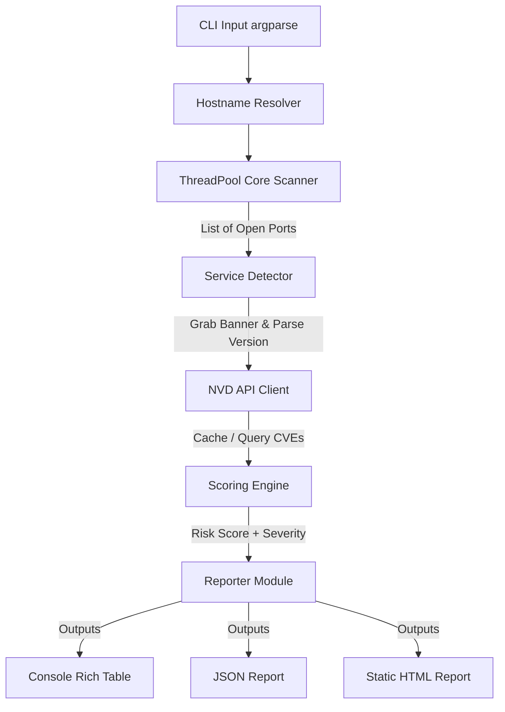

# Risk-Scoring Port Scanner - Project Report

## 1. Problem Statement
Traditional port scanners (like basic TCP connect wrappers) only report whether a port is open or closed. While this is helpful for firewall audits, it lacks context. A security engineer needs to know:
1. What service is actually running on the port (not just the default port-to-service mapping)?
2. What version is the service running, and does it have known vulnerabilities (CVEs)?
3. What is the overall threat level (risk score) of the host?

This project solves this by creating a CLI tool that automates the entire audit pipeline: port scanning -> service banner extraction -> CVE cross-referencing -> qualitative risk scoring -> reporting.

---

## 2. Architecture & Pipeline

The tool is structured as a pipeline, where data flows from the command line down to the final report generators.

### Module Breakdown:
1.  **`scanner.py`**: The main controller. Coordinates the scanning, detection, lookup, scoring, and output generation stages.
2.  **`port_scanner/cli.py`**: Handles CLI arguments using `argparse`, validates ports and range inputs, parses presets, and retrieves NVD API keys.
3.  **`port_scanner/core.py`**: Coordinates multithreaded socket connect operations using a `ThreadPoolExecutor` to speed up scans.
4.  **`port_scanner/detector.py`**: Extracts service and version information by listening for protocol greetings or probing HTTP/HTTPS headers.
5.  **`port_scanner/nvd.py`**: Handles NVD API keywordSearch queries, throttles requests according to API key presence, manages retries/backoff, and persists cache records inside a local SQLite database (`cve_cache.db`).
6.  **`port_scanner/scoring.py`**: Implements the quantitative risk-scoring model.
7.  **`port_scanner/reporter.py`**: Exports data into a rich CLI layout, machine-readable JSON, or a responsive HTML dashboard.

---

## 3. Design Decisions

### A. TCP Connect Scan vs. SYN Scan
*   **TCP Connect Scan (Chosen)**:
    - *Advantages*: Runs entirely in user-space without administrative or root privileges. It utilizes the operating system's standard network stack (`socket.connect_ex`), making it cross-platform (works seamlessly on Windows, macOS, and Linux without external drivers).
    - *Disadvantages*: Noisy, as it completes the full 3-way handshake (`SYN` -> `SYN-ACK` -> `ACK`), which is easily logged by firewalls and IDSes.
*   **SYN Scan (Half-Open Scan)**:
    - *Advantages*: Stealthier, as it tears down the connection (`RST`) before it completes.
    - *Disadvantages*: Requires raw socket access, which requires root/administrator privileges. On Windows, raw sockets are heavily restricted and require third-party packet drivers like `Npcap`.
*   *Conclusion*: For portability, ease of installation, and ease of use in a development/portfolio environment, the **TCP Connect Scan** was the superior design choice.

### B. SQLite Caching for NVD CVEs
Because NVD API v2.0 enforces strict rate limits (especially without an API key), a cache is essential.
- **Dict vs SQLite**: A dictionary cache would lose all entries when the CLI tool exits. A SQLite database (`cve_cache.db`) stores responses permanently, meaning repeat scans of common services (like SSH or Apache) occur instantly.
- **Cache Expiry**: Set to 7 days, allowing the tool to periodically refresh its records to fetch newly published vulnerabilities.

### C. Host Risk-Scoring Formula
Our risk scoring uses a weighted model:
$$R = \min\left(10.0, S_{max} + 0.1 \times \sum_{i \neq max} S_i + \min(1.0, 0.05 \times N_{open\_clean})\right)$$
*   **S_max** represents the weakest link. If a host has one Critical vulnerability (CVSS 9.8), it is inherently Critical, regardless of how secure other ports are.
*   **0.1 * Sum(S_i)** represents compounding risk. An attacker can use minor vulnerabilities in tandem (exploit chaining) to escalate privileges.
*   **0.05 * N_clean** represents the attack surface. Every open port (even if currently unvulnerable) is a potential future target.

---

## 4. Limitations & Challenges

1.  **UDP Services**: This scanner only targets TCP. UDP is connectionless and does not respond to simple connect scans, requiring specialized probe packets.
2.  **Fuzzy CVE Matching**: Because banner text is unstructured (e.g. `Apache/2.4.41 (Unix) OpenSSL/1.1.1d`), extracting the exact product and version name for NVD keyword search is sometimes challenging. A slight mismatch (e.g. searching "OpenSSH_8.2p1" instead of "OpenSSH 8.2p1") might return different NVD results. We mitigated this by writing precise regular expressions to clean banners.
3.  **Firewall Blocking**: Connect scans can trigger security policies, leading to rate-limiting or IP blocks.

---

## 5. Future Enhancements
- **CPE Match Criteria**: Upgrade the NVD API client to search using CPE (Common Platform Enumeration) names instead of keywords for higher accuracy.
- **UDP Port Scanning**: Add a multithreaded UDP scan module.
- **Fingerprinting Probes**: Implement a scriptable probe system (similar to Nmap's `.nse`) to send custom payloads to ports to force banners from silent services.
